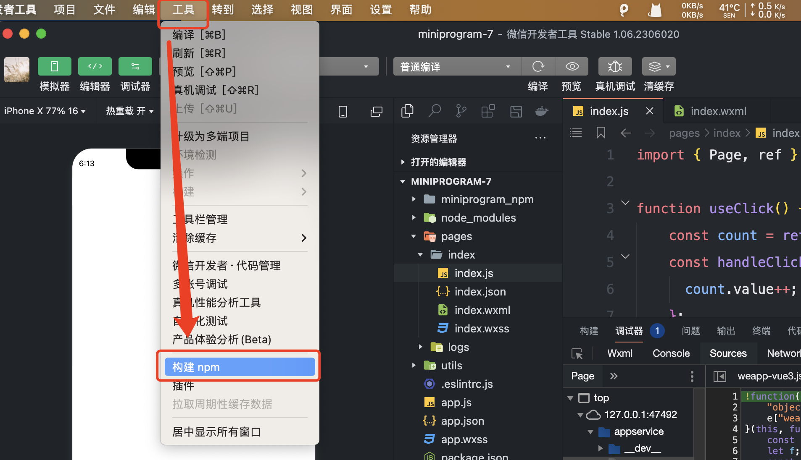
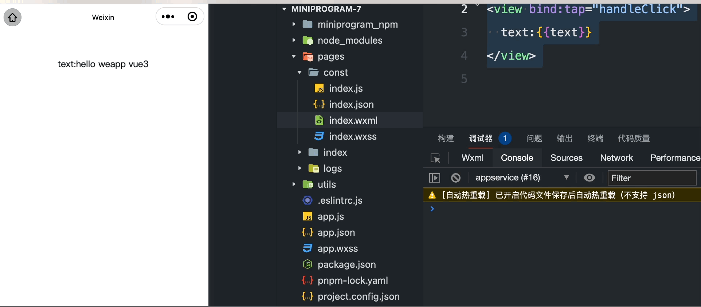
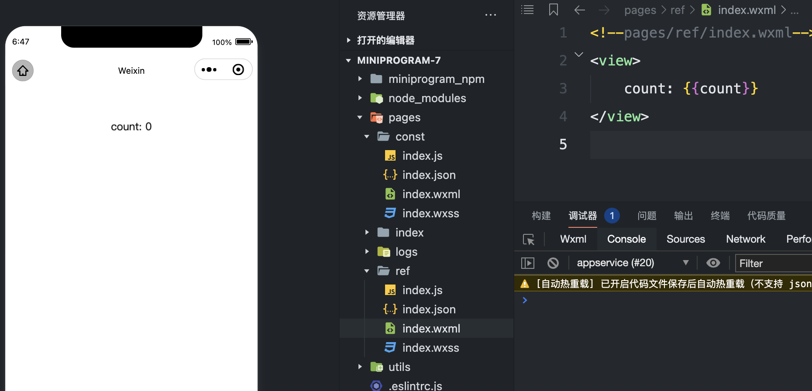

# weapp-vue3
创建微信小程序支持hooks（vue3版本）

## 安装

```shell
# npm
npm install @52css/weapp-vue3 --save

# yarn
yarn add @52css/weapp-vue3

# pnpm
pnpm install @52css/weapp-vue3 --save
```

## 在小程序中构建



## API

### Page 页面

```js
import { Page } from '@52css/weapp-vue3'

Page(() => {
  // 里面使用hooks方法
})
```

### Component 组件

```js
import { Component } from '@52css/weapp-vue3'

// 方式一，直接是hooks方法
Component(() => {
  // 里面使用hooks方法
})

// 方式二，传递options
Component({
  props: {
    type: String
  },
  setup(props, ctx) {
    // 这里是hooks方法
  }
})
```

### 定义常量、方法

js

```js
import { Page } from '@52css/weapp-vue3'

Page(() => {
  const text = 'hello weapp vue3'
  const handleClick = () => {
    console.log('text', text)
  }

  // 所有定义必须返回
  return { text, handleClick }
})
```

wxml
```html
<view bind:tap="handleClick">
  text:{{text}}
</view>
```

效果



### ref

js

```js
import { Page, ref } from '@52css/weapp-vue3'

Page(() => {
  const count = ref(0)

  // 所有定义必须返回
  return { count }
})
```

wxml
```html
<view>
  count: {{count}}
</view>
```

效果


### reactive

js

```js
import { Page, reactive, toRefs } from '@52css/weapp-vue3'

Page(() => {
  const state = reactive({loading: false})

  // 所有定义必须返回
  return { ...toRefs(state) }
})
```

wxml

### computed

```js
import { Page, ref, computed } from '@52css/weapp-vue3'

Page(() => {
  const count = ref(0)
  const doubleCount = computed(() => count.value * 2)

  // 所有定义必须返回
  return { count, doubleCount }
})
```

### watch

```js
import { Page, ref, watch } from '@52css/weapp-vue3'

Page(() => {
  const count = ref(0)
  const handleClick = () => {
    count.value ++
  }

  watch(count, (newVal, oldVal) => {
    console.log('newVal', newVal, oldVal)
  })

  // 所有定义必须返回
  return { count, handleClick }
})
```

## 生命周期

### TODO